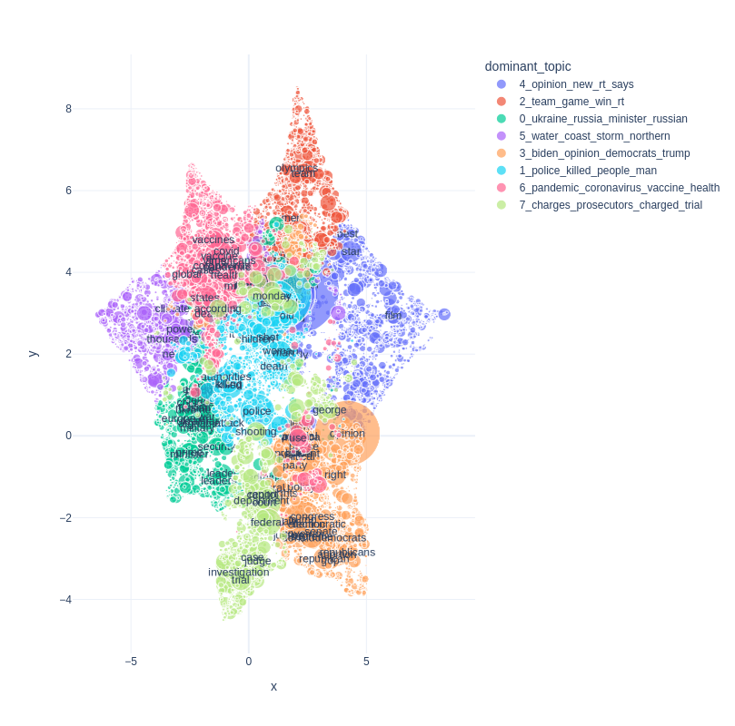
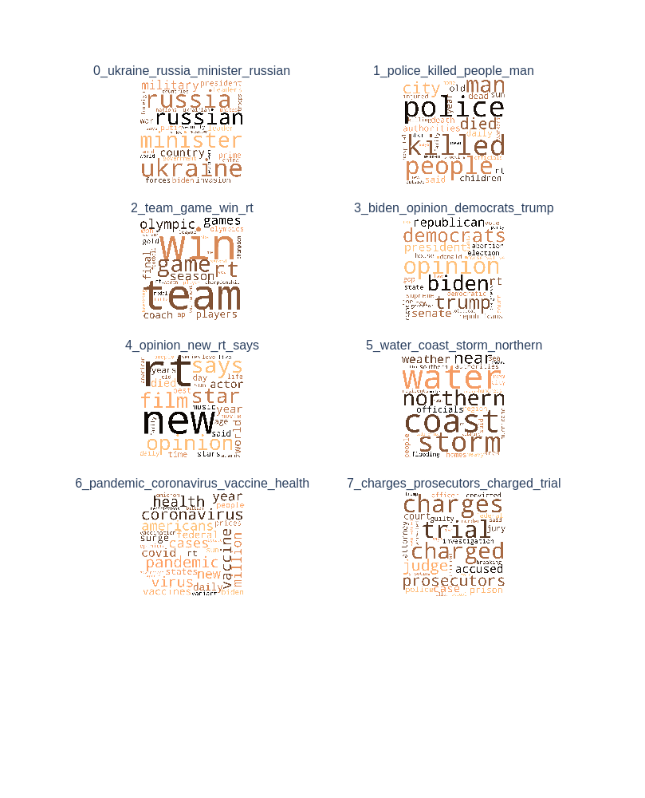

# topicwizard

<br>

Pretty and opinionated topic model visualization in Python.

[](https://colab.research.google.com/github/x-tabdeveloping/topic-wizard/blob/main/examples/basic_usage.ipynb)
[](https://pypi.org/project/topic-wizard/)
[](https://pypi.org/project/topic-wizard/)
[](https://github.com/centre-for-humanities-computing/tweetopic)
[](https://black.readthedocs.io/en/stable/the_black_code_style/current_style.html)
<br>


https://github.com/x-tabdeveloping/topicwizard/assets/13087737/9736f33c-6865-4ed4-bc17-d8e6369bda80


## New in version 1.1.0

### Easier Deployment and Faster Cold Starts

If you want to produce a deployment of topicwizard with a fitted topic model, you can now produce a Docker deployment folder with `easy_deploy()`.

```python
import joblib
import topicwizard

# Load previously produced topic_data object
topic_data = joblib.load("topic_data.joblib")

topicwizard.easy_deploy(topic_data, dest_dir="deployment", port=7860)
```

This will put everything you need in the `deployment/` directory, and will work out of the box on cloud platforms or HuggingFace Spaces.

Cold starts are now faster, as UMAP projections can be precomputed.

```python
topic_data_w_positions = topicwizard.precompute_positions(topic_data)
```

## New in version 1.0.0 🌟 

 - Compatiblity with contextually sensitive topic models in Turftopic and BERTopic.
 - Easier and more streamlined persistence and interoperability.
 - Smaller building blocks for constructing figures and apps.

## Features

-   Investigate complex relations between topics, words, documents and groups/genres/labels interactively
-   Easy to use pipelines for classical topic models that can be utilized for downstream tasks
-   Sklearn, Turftopic, Gensim and BERTopic compatible  :nut_and_bolt:
-   Interactive and composable Plotly figures
-   Rename topics at will
-   Share your results
-   Easy deployment :earth_africa:

## Installation

Install from PyPI:

> Notice that the package name on PyPI contains a dash: `topic-wizard` instead of `topicwizard`.
> I know it's a bit confusing, sorry for that

```bash
pip install topic-wizard
```

## [Classical Topic Models](https://x-tabdeveloping.github.io/topicwizard/usage.pipelines.html)

The main abstraction of topicwizard around a classical/bag-of-words models is a topic pipeline, 
which consists of a vectorizer, that turns texts into bag-of-words
representations and a topic model which decomposes these representations into vectors of topic importance.
topicwizard allows you to use both scikit-learn pipelines or its own `TopicPipeline`.


Let's build a pipeline. We will use scikit-learns CountVectorizer as our vectorizer component:
```python
from sklearn.feature_extraction.text import CountVectorizer

vectorizer = CountVectorizer(min_df=5, max_df=0.8, stop_words="english")
```
The topic model I will use for this example is Non-negative Matrix Factorization as it is fast and usually finds good topics.
```python
from sklearn.decomposition import NMF

model = NMF(n_components=10)
```
Then let's put this all together in a pipeline. You can either use sklearn Pipelines...
```python
from sklearn.pipeline import make_pipeline

topic_pipeline = make_pipeline(vectorizer, model)
```

Or topicwizard's [TopicPipeline](https://x-tabdeveloping.github.io/topicwizard/usage.pipelines.html#topicpipeline)

```python
from topicwizard.pipeline import make_topic_pipeline

topic_pipeline = make_topic_pipeline(vectorizer, model)
```

You can also turn an already existing pipeline into a `TopicPipeline`.

```python
from topicwizard.pipeline import TopicPipeline

topic_pipeline = TopicPipeline.from_pipeline(pipeline)
```

Let's load a corpus that we would like to analyze, in this example I will use 20newsgroups from sklearn.

```python
from sklearn.datasets import fetch_20newsgroups

newsgroups = fetch_20newsgroups(subset="all")
corpus = newsgroups.data

# Sklearn gives the labels back as integers, we have to map them back to
# the actual textual label.
group_labels = [newsgroups.target_names[label] for label in newsgroups.target]
```

Then let's fit our pipeline to this data:
```python
topic_pipeline.fit(corpus)
```

> Models do not necessarily have to be fitted before visualizing, topicwizard fits the model automatically on the corpus if it isn't prefitted.

Then launch the topicwizard web app to interpret the model.

```python
import topicwizard

topicwizard.visualize(corpus, model=topic_pipeline)
```

### Gensim

You can also use your gensim topic models in topicwizard by wrapping them in a `TopicPipeline`.

```python
from gensim.corpora.dictionary import Dictionary
from gensim.models import LdaModel
from topicwizard.compatibility import gensim_pipeline

texts: list[list[str]] = [
    ['computer', 'time', 'graph'],
    ['survey', 'response', 'eps'],
    ['human', 'system', 'computer'],
    ...
]

dictionary = Dictionary(texts)
bow_corpus = [dictionary.doc2bow(text) for text in texts]
lda = LdaModel(bow_corpus, num_topics=10)

pipeline = gensim_pipeline(dictionary, model=lda)
# Then you can use the pipeline as usual
corpus = [" ".join(text) for text in texts]
topicwizard.visualize(corpus, model=pipeline)
```

## Contextually Sensitive Models *(New in 1.0.0)*

topicwizard can also help you interpret topic models that understand contextual nuances in text, by utilizing representations from [sentence transformers](https://www.sbert.net/).
The package is mainly designed to be compatible with [turftopic](https://github.com/x-tabdeveloping/turftopic),
which to my knowledge contains the broadest range of contextually sensitive models,
but we also provide compatibility with [BERTopic](https://maartengr.github.io/BERTopic/index.html).

Here's an example of interpreting a [Semantic Signal Separation](https://x-tabdeveloping.github.io/turftopic/s3/) model over the same corpus.

```python
import topicwizard
from turftopic import SemanticSignalSeparation

model = SemanticSignalSeparation(n_components=10)
topicwizard.visualize(corpus, model=model)
```

You can also use BERTopic models by wrapping them in a compatibility layer:

```python
from bertopic import BERTopic
from topicwizard.compatibility import BERTopicWrapper

model = BERTopicWrapper(BERTopic(language="english"))
topicwizard.visualize(corpus, model=model)
```

The documentation also includes examples of how you can construct Top2Vec and CTM models in turftopic,
or you can write your own wrapper quite easily if needed.

## [Web Application](https://x-tabdeveloping.github.io/topicwizard/application.html)

You can launch the topic wizard web application for interactively investigating your topic models. The app is also quite easy to [deploy](https://x-tabdeveloping.github.io/topicwizard/usage.deployment.html) in case you want to create a client-facing interface.

```python
import topicwizard

topicwizard.visualize(corpus, model=topic_pipeline)
```

From version 0.3.0 you can also disable pages you do not wish to display thereby sparing a lot of time for yourself:

```python
# A large corpus takes a looong time to compute 2D projections for so
# so you can speed up preprocessing by disabling it alltogether.
topicwizard.visualize(corpus, pipeline=topic_pipeline, exclude_pages=["documents"])
```
| [Topics](https://x-tabdeveloping.github.io/topicwizard/usage.topics.html) | [Words](https://x-tabdeveloping.github.io/topicwizard/usage.words.html) |
| :----: | :----: |
|  |   |

[Documents](https://x-tabdeveloping.github.io/topicwizard/usage.documents.html) | [Groups](https://x-tabdeveloping.github.io/topicwizard/usage.groups.html) |
| :----: | :----: |
|  |  |

## TopicData

All compatible models in topicwizard have a `prepare_topic_data()` method, which produces a `TopicData` object containing information about topical inference and model fit on a given corpus.

TopicData is in essence a typed dictionary, containing all information that is needed for interactive visualization in topicwizard. 

You can produce this data with `TopicPipeline`

```python
pipeline = make_topic_pipeline(CountVectorizer(), NMF(10))
topic_data = pipeline.prepare_topic_data(corpus)
```

And with contextual models:
```python
model = SemanticSignalSeparation(10)
topic_data = model.prepare_topic_data(corpus)

# or with BERTopic
model = BERTopicWrapper(BERTopic())
topic_data = model.prepare_topic_data(corpus)
```

`TopicData` can then be used to spin up the web application.

```python
import topicwizard

topicwizard.visualize(topic_data=topic_data)
```

This data structure can be serialized, saved and shared.
topicwizard uses `joblib` for serializing the data.

> Beware that topicwizard 1.0.0 is no longer fully backwards compatible with the old topic data files.
> No need to panic, you can either construct `TopicData` manually from the old data structures, or try to run the app anyway.
> It will probably work just fine, but certain functionality might be missing.


```python
import joblib
from topicwizard.data import TopicData

# Save the data
joblib.dump(topic_data, "topic_data.joblib")

# Load the data
# (The type annotation is just for type checking, it doesn't do anything)
topic_data: TopicData = joblib.load("topic_data.joblib")
```

> When sharing across machines, make sure that everyone is on the same page with versions of the different packages.
> For example if the inference machine has `scikit-learn==1.2.0`, it's advisable that you have a version on the server that is compatible, otherwise deserialization might fail.
> Same thing goes for BERTopic and turftopic of course.

In fact when you click the download button in the application this is exactly what happens in the background.

The reason that this is useful, is that you might want to have the results of an inference run on a server locally, or you might want to run inference on a different machine from the one that is used to deploy the application.

## [Figures](https://x-tabdeveloping.github.io/topicwizard/api_reference.html#module-topicwizard.figures)

If you want customizable, faster, html-saveable interactive plots, you can use the figures API.

All figures are produced from a `TopicData` object so that you don't have to run inference twice on the same corpus for two different figures.

Here are a couple of examples:

```python
from topicwizard.figures import word_map, document_topic_timeline, topic_wordclouds, word_association_barchart
```

| Word Map | Timeline of Topics in a Document | 
| :----: | :----: |
| `word_map(topic_data)` | `document_topic_timeline(topic_data, "Joe Biden takes over presidential office from Donald Trump.")` |
|  |  |

| Wordclouds of Topics | Topic for Word Importance |
| :----: | :----: |
| `topic_wordclouds(topic_data)` | `word_association_barchart(topic_data, ["supreme", "court"])` |
|  |  |

Figures in topicwizard are in essence just Plotly interactive figures and they can be modified at will.
Consult [Plotly's documentation](https://plotly.com/python/) for more details about manipulating and building plots.

For more information consult our [Documentation](https://x-tabdeveloping.github.io/topicwizard/index.html)
