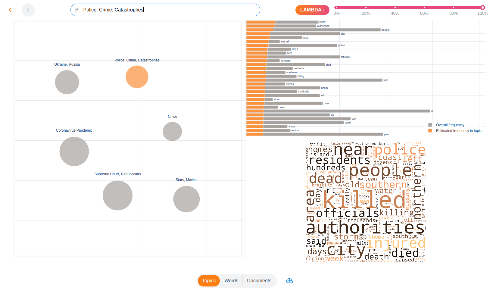
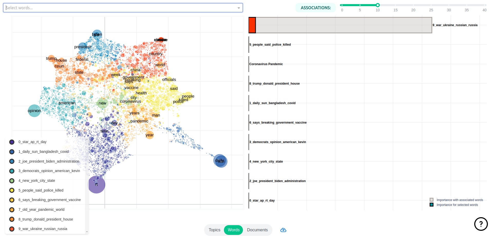
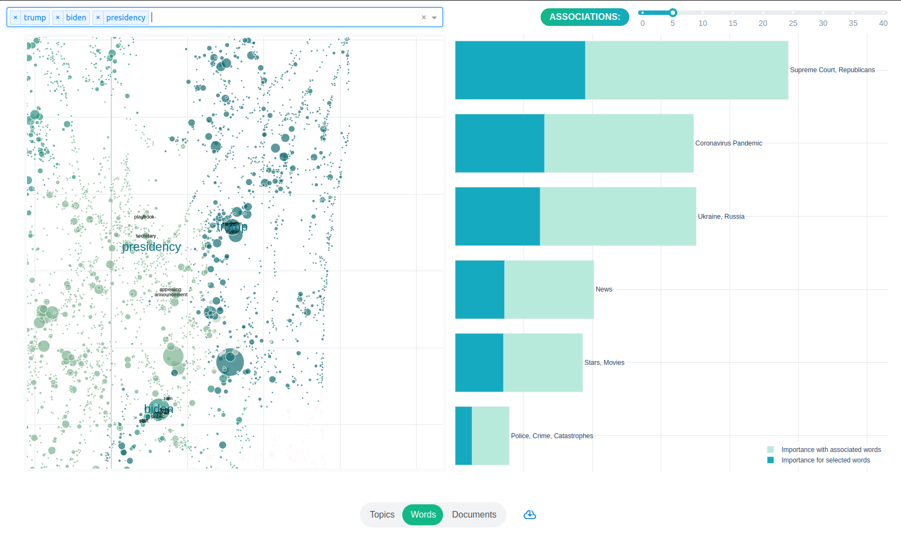
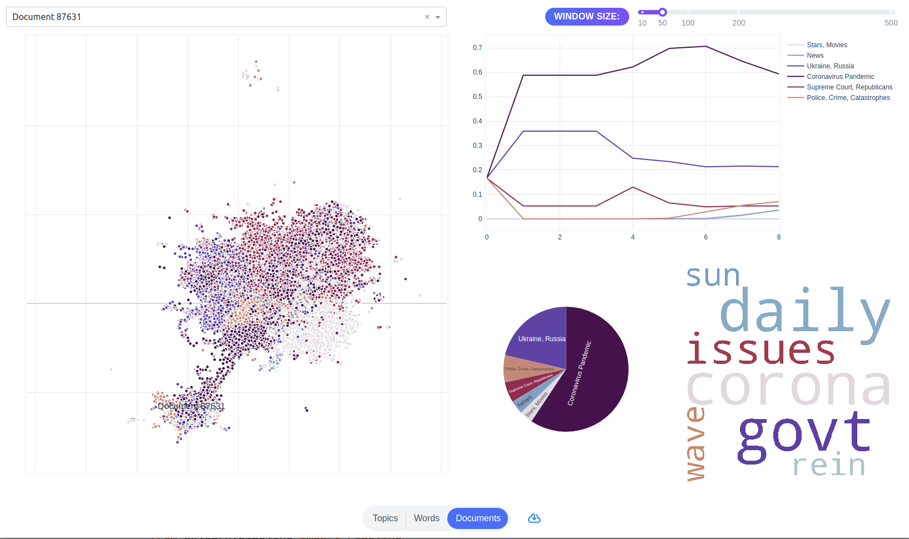

# topicwizard

<br>

Pretty and opinionated topic model visualization in Python.

[](https://colab.research.google.com/github/x-tabdeveloping/topic-wizard/blob/main/examples/basic_usage.ipynb)
[](https://pypi.org/project/topic-wizard/)
[](https://pypi.org/project/topic-wizard/)
[](https://github.com/centre-for-humanities-computing/tweetopic)
[](https://black.readthedocs.io/en/stable/the_black_code_style/current_style.html)
<br>


https://user-images.githubusercontent.com/13087737/234209888-0d20ede9-2ea1-4d6e-b69b-71b863287cc9.mp4

## New in version 0.2.5 🌟 🌟

 - [Compatiblity with Gensim topic models](https://x-tabdeveloping.github.io/topic-wizard/usage.compatibility.html) 💥
 - [Compatibility with BERTopic](https://x-tabdeveloping.github.io/topic-wizard/usage.compatibility.html)(experimental 🧪)
 - Topic name inference 🧠


## Features

-   Investigate complex relations between topics, words and documents
-   Highly interactive
-   Automatically infer topic names
-   Name topics manually
-   Pretty :art:
-   Intuitive :cow:
-   Clean API :candy:
-   Sklearn, Gensim and BERTopic compatible :nut_and_bolt:
-   Easy deployment :earth_africa:

## Installation

Install from PyPI:

```bash
pip install topic-wizard
```

## Usage ([documentation](https://x-tabdeveloping.github.io/topic-wizard/))

### Step 1:

Train a scikit-learn compatible topic model.
(If you want to use non-scikit-learn topic models, check [compatibility](https://x-tabdeveloping.github.io/topic-wizard/usage.compatibility.html))

```python
from sklearn.decomposition import NMF
from sklearn.feature_extraction.text import CountVectorizer
from sklearn.pipeline import make_pipeline

# Create topic pipeline
topic_pipeline = make_pipeline(
    CountVectorizer(),
    NMF(n_components=10),
)

# Then fit it on the given texts
topic_pipeline.fit(texts)
```

### Step 2:

Visualize with topicwizard.

```python
import topicwizard

# You can get automatically assigned topic labels, that you can change manually later
topic_names = topicwizard.infer_topic_names(pipeline=pipeline)

# Then you can visualize your results
topicwizard.visualize(pipeline=topic_pipeline, corpus=texts, topic_names=topic_names)
```

### Step 3:

Investigate :eyes: .

#### a) Topics



#### b) Words




#### c) Documents


