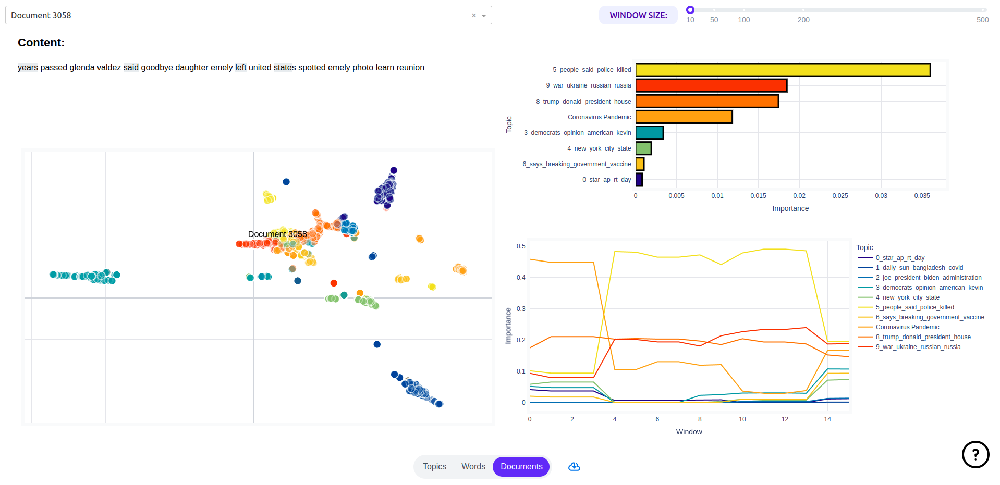

.. _application:

Web Application
==================

As stated earlier topicwizard is easiest to use with the default visualization dashboard that comes with it,
as this provides a general and interactive overview of the topic models you wish to interpret.

For this example let's train a Non-negative Matrix Factorization model over a corpus of texts we have.

.. code-block:: python

   # Training a compatible topic model
   from sklearn.decomposition import NMF
   from sklearn.feature_extraction.text import CountVectorizer
   from topicwizard.pipeline import make_topic_pipeline

   bow_vectorizer = CountVectorizer()
   nmf = NMF(n_components=10)
   pipeline = make_topic_pipeline(bow_vectorizer, nmf)
   pipeline.fit(texts)

Once you have trained a topic model, like NMF, 
interpreting the model in topicwizard is as trivial as starting the web application with the visualize() function.

.. code-block:: python

   import topicwizard

   topicwizard.visualize(texts, model=pipeline)

topicwizard can take :ref:`Classical Topic Models <usage pipelines>`, :ref:`Contextually Sensitive Models <usage contextual>` along with a corpus, or a TopicData object.

.. code-block:: python

   from turftopic import SemanticSignalSeparation

   model = SemanticSignalSeparation(n_components=10)

   topicwizard.visualize(texts, model=model)

   ## OR

   topic_data = model.prepare_topic_data(texts)
   topicwizard.visualize(topic_data=topic_data)

Pages
-----

This will open a web app in a new browser tab with three pages, one for topics, one for words and one for documents,
where you can investigate the intricate relations of these in an interactive fashion.

.. note::
    To understand how the plots at the pages are generated, hover over the question mark in the lower left corner.

Topics
^^^^^^

The first page of the webapp is a general overview of the topics in the model.
On the left you can see a topic map, on which you can click
on topics to investigate them and see word importances in the given topics on bar charts and wordclouds.

.. image:: _static/screenshot_topics.png
    :width: 800
    :alt: Screenshot of topics.

Words
^^^^^

The Words pages displays words' semantic relations to each other and topics.
You have access to a semantic map over word representations in the topics models
and a bar chart displaying topic importances
for selected words and their closest associations.

.. image:: _static/screenshot_words.png
    :width: 800
    :alt: Screenshot of words.

Documents
^^^^^^^^^

On this page you will see a map of document representations,
along with utilities for exploring a given document's content 
by looking topical content overall and over time in the document.

You can also search for specific documents that you might have special interest in.

.. note::
    With large corpora this page is by far the slowest to start up, as such I would recommend that you disable it
    unless you have special interest in the individual documents in your corpus.
    This is because document representations are high-dimensional and there is usually a lot of documents,
    calculating 2D UMAP projections for such data is slow and tedious.

Groups (optional)
^^^^^^^^^^^^^^^^^

If you have gold standard group labels for your corpus, these can be passed to the web application.

Here's an example of doing this with the 20Newsgroups dataset.

.. code-block:: python

   import topicwizard
   from topicwizard.pipeline import make_topic_pipeline
   from sklearn.datasets import fetch_20newsgroups

   newsgroups = fetch_20newsgroups(subset="all")
   corpus = newsgroups.data
   # Sklearn gives the labels back as integers, we have to map them back to
   # the actual textual label.
   group_labels = np.array(newsgroups.target_names)[newsgroups.target]

   # Here we fit a topic model to the corpus
   pipeline = make_topic_pipeline(
       CountVectorizer(stop_words="english"),
       NMF(n_components=30),
   ).fit(corpus)

   # Notice that I'm passing the labels as the group_labels argument
   topicwizard.visualize(corpus, model=pipeline, group_labels=group_labels)

This will add an additional page, which can be used to investigate these labels' relations to topics and word content.

.. image:: _static/screenshot_groups.png
    :width: 800
    :alt: Screenshot of groups.

Performance Tips
----------------

Beware that if you display all three pages, especially with larger corpora or vocabularies, topicwizard might take a long time
to start up.
This is because visualizing documents, words and topics is hard. You need to have 2D projections of their embeddings, for
which topicwizard uses a method called UMAP, which produces nicely interpretable projections, but takes a long time to train
and infer.

If you just want a drop-in replacement of PyLDAvis for your project, and you only care about word importances for
your topics, you can disable the words and documents pages with the exclude_pages argument.

.. code-block:: python

   topicwizard.visualize(texts, model=pipeline, exclude_pages=["documents", "words"])

Or equally if you use a matrix decomposition method for creating word embeddings like LSI for example, you can use topicwizard to visualize your embeddings
and disable all else:

.. code-block:: python

   topicwizard.visualize(texts, model=pipeline, exclude_pages=["documents", "topics"])

API Reference
-------------

.. autofunction:: topicwizard.visualize

.. autofunction:: topicwizard.get_dash_app
