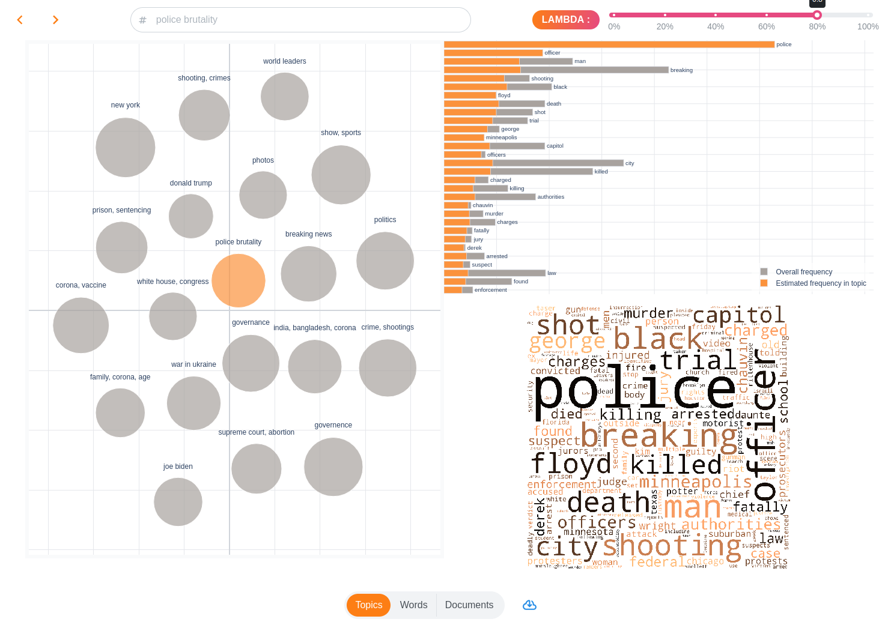

Getting Started
==================

topicwizard is a pretty and opinionated Python library for topic model visualization built on Dash and Plotly.
This website contains the user guide to topicwizard as well as the API reference.

Installation
^^^^^^^^^^^^

topicwizard can be simply installed by installing the PyPI package.

.. code-block::

   pip install topic-wizard

Usage
^^^^^^^^^
.. raw:: html

   

Train a scikit-learn compatible topic pipeline.

.. note::
   If you intend to investigate non-scikit-learn models, please have a look at
   :ref:`Compatibility <usage compatibility>`

.. code-block:: python

   from sklearn.decomposition import NMF
   from sklearn.feature_extraction.text import CountVectorizer
   from topicwizard.pipeline import make_topic_pipeline

   bow_vectorizer = CountVectorizer()
   nmf = NMF(n_components=10)
   topic_pipeline = make_topic_pipeline(bow_vectorizer, nmf)
   topic_pipeline.fit(texts)

The easiest and most sensible way to visualize is with the topicwizard web application.

.. code-block:: python

   import topicwizard

   topicwizard.visualize(texts, pipeline=topic_pipeline)

You can also you individual interactive plots to create individual visualizations you might be interested in.

Here is an example of how you can visualize words' relations to each other in a topic model:

.. code-block:: python
   
   from topicwizard.figures import word_map

   word_map(corpus=texts, pipeline=pipeline)

.. raw:: html
   :file: _static/plots/word_map.html

This will open a new browser tab in which you can investigate topic models visually.

.. toctree::
   :maxdepth: 2
   :caption: User guide

   usage.pipelines
   application
   usage.topics
   usage.words
   usage.documents
   usage.groups
   usage.persistence
   usage.compatibility
   usage.deployment

.. toctree::
   :maxdepth: 2
   :caption: API reference

   api_reference

.. toctree::
   GitHub Repository <https://github.com/x-tabdeveloping/topic-wizard>
