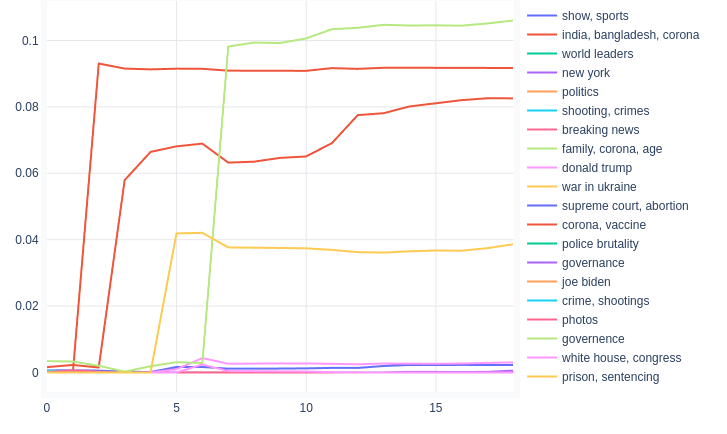

.. _usage documents:

Investigating Documents
=======================

When you click 'Documents' on the navigation bar you will be presented with this screen.

.. image:: _static/screenshot_documents.png
    :width: 800
    :alt: Screenshot of documents.

Document map
^^^^^^^^^^^^^

On the left you will see a plot showing you all the documents, aka. the document map.

.. image:: _static/document_map.png
    :width: 800
    :alt: Document map.

Document positions are calculated from document embeddings created by the vectorizer by reducing dimensionality to 2 with
TruncatedSVD.
You can zoom this graph by dragging your cursor and enclosing a selection area.

Selecting documents
^^^^^^^^^^^^^^^^^^^^

You can either select documents by clicking on them on the document map,
or by searching for them in the "Select document" field above the map.

Wordcloud
^^^^^^^^^^^^^^^^^^^^^^
The most used words in the document are displayed on a wordcloud.

.. image:: _static/document_wordcloud.png
    :width: 800
    :alt: wordcloud.

The wordcloud is draggable with the cursor and zoomable by scrolling.

Topic use
^^^^^^^^^^^^^^^^^^^^^^
Use of topics in the document is displayed with a pie chart.

.. image:: _static/document_piechart.png
    :width: 800
    :alt: Pie chart.

Topic Timeline
^^^^^^^^^^^^^^^^^^^^^^
You will also see a timeline which visualizes the use of topics over time in the document.

You can remove topics from the plot by clicking them on the right.
You can select individual topics by double clicking on them.

Topic use is calculated with rolling windows of words over the document.
You can adjust window size by dragging the slider on top.

:ref:`Topics <usage topics>`

:ref:`Words <usage words>`