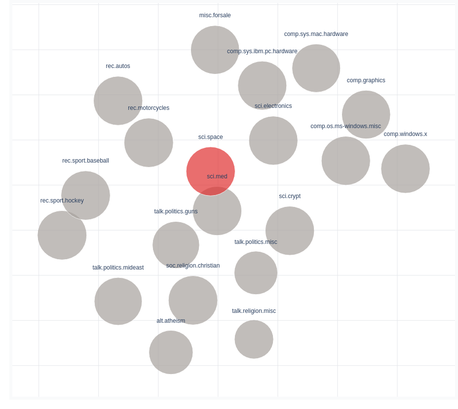
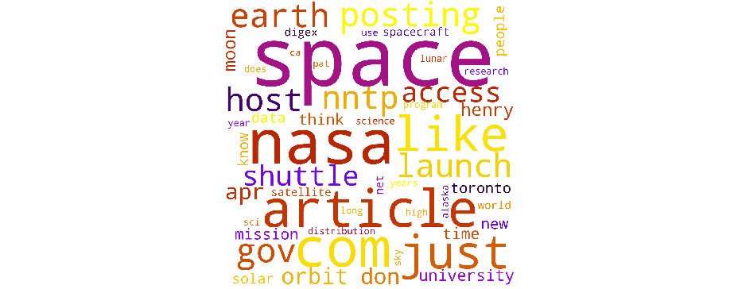

.. _usage groups:

Investigating Groups
=======================

In a scenario where you have pre-existing labels for your documents, like let's say genre, or a domain from which you scraped them, topicwizard
allows you to investigate these groups' relation to topics and words.

Web App
-----------

If you have pre-labelled documents you can pass these document labels to visualize(), this will implicitly add a "Groups" page to the web application.
In this example I am going to use the 20 newsgroups dataset from scikit-learn.

.. code-block:: python

   import topicwizard
   from sklearn.datasets import fetch_20newsgroups

   newsgroups = fetch_20newsgroups(subset="all")
   corpus = newsgroups.data
   # Sklearn gives the labels back as integers, we have to map them back to
   # the actual textual label.
   group_labels = np.array(newsgroups.target_names)[newsgroups.target]

   # Here we fit a topic model to the corpus
   pipeline = make_pipeline(
       CountVectorizer(stop_words="english", max_df=0.5, min_df=10),
       NMF(n_components=30),
   ).fit(corpus)

   # Notice that I'm passing the labels as the group_labels argument
   topicwizard.visualize(corpus=corpus, pipeline=pipeline, group_labels=group_labels)

This page will be added to the web application:

.. image:: _static/screenshot_groups.png
    :width: 800
    :alt: Screenshot of groups.

Group map
^^^^^^^^^^

On the left you will see a bubble chart displaying the group map.

Group positions are calculated from Bag-of-words representations, and projected into 2-dimensional space with UMAP.
Group sizes correspond to the number of documents in each group.

Group Barchart
^^^^^^^^^^^^^^

When you click on a group on the map, a bar chart on the right will be displayed with the 10 highest-ranking topics for the given group
and their importances over all groups for comparison.

.. image:: _static/group_barchart.png
    :width: 800
    :alt: Group topic barchart.

Group Wordcloud
^^^^^^^^^^^^^^^

On the right there will also be a wordcloud of the most frequent words in the given group.

Self-Contained Plots
--------------------

It might be an overkill for you to display the entire page, and you might want static html plots instead of the entire application running.
This can be particulary useful for reports with DataPane or Jupyter Notebooks.

Group Map
^^^^^^^^^

You can display the group map as a standalone plot, with the groups being colored according to dominant topic.
Just like on the document map you can choose whether you would like to use the term or the topic representations
for displaying the map.

.. code-block:: python
   
   from topicwizard.figures import group_map

   group_map(corpus, group_labels, pipeline=pipeline, representation="term")

.. raw:: html
   :file: _static/plots/group_map_term.html

.. code-block:: python
   
   group_map(corpus, group_labels, pipeline=pipeline, representation="topic")

.. raw:: html
   :file: _static/plots/group_map_topic.html

Group Topic Barcharts
^^^^^^^^^^^^^^^^^^^^^

You can create a joint plot of the topic content of all groups.
These will be displayed as bar charts.

.. code-block:: python
   
   from topicwizard.figures import group_topic_barcharts

   group_topic_barcharts(corpus, group_labels, pipeline=pipeline, top_n=5)

.. raw:: html
   :file: _static/plots/group_topic_barcharts.html

Word Clouds
^^^^^^^^^^^^^

You can create word clouds for each of the group labels. This will only take word counts into account and not relevance.

.. code-block:: python

   from topicwizard.figures import group_wordclouds

   group_wordclouds(corpus, group_labels, pipeline=pipeline)

.. raw:: html
   :file: _static/plots/group_wordclouds.html
