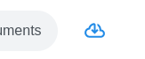

.. _usage persistence:

Persistence
=============

You can persist your results by clicking on the download button right next to the navigation bar.

This will serialize all inference information into a `TopicData <topic data>`_ object,
including the topic names you have specified while using the application.

This is virtually equivalent to saving the `TopicData <topic data>`_ on the server directly,
using the prepare_topic_data() method of compatible models or `TopicPipelines <usage pipelines>`_,
except for manually assigned topic names.

.. warning::

   topicwizard 1.0.x provides no backwards compatibility for topic data downloaded with previous versions of the package.
   Old objects have to be manually converted into `TopicData <topic data>`_ if you intend to use them.

Serialization is done with `joblib <https://joblib.readthedocs.io/en/stable/>`_.

.. code-block:: python

   from turftopic import KeyNMF
   import joblib

   model = KeyNMF(10)
   topic_data = model.prepare_topic_data(corpus)

   joblib.dump(topic_data, "topic_data.joblib")

Then this data can be loaded again using joblib.

.. note::

   Make sure that the receiving end has the same topic modeling packages with the same version (sklearn, turftopic, bertopic etc.),
   otherwise you might encounter issues with deserialization.

.. code-block:: python

   import topicwizard
   # We import this only for type checking
   from topicwizard.data import TopicData
   import joblib

   topic_data: TopicData = joblib.load("topic_data.joblib")

   topicwizard.visualize(topic_data=topic_data)

