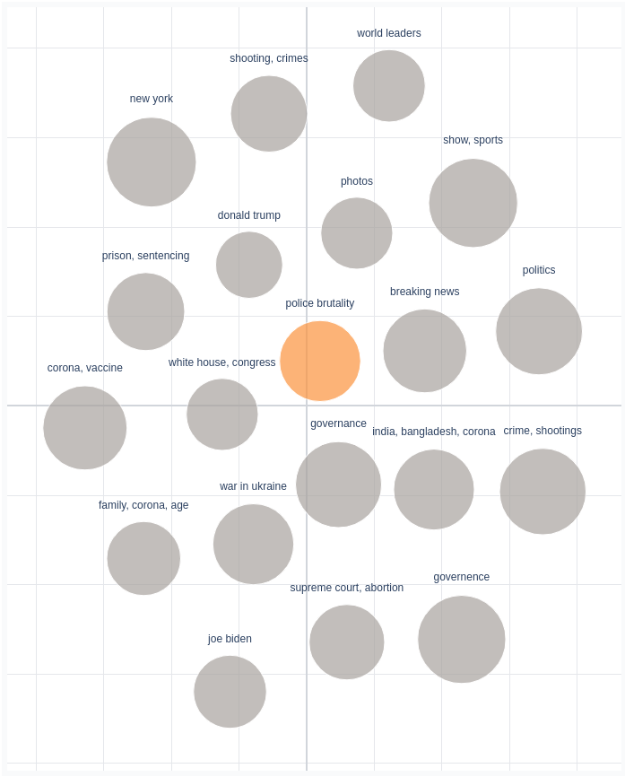
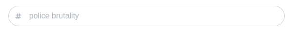

.. _usage topics:

Investigating Topics
=======================

When you click 'Topics' on the navigation bar you will be presented with this screen.

.. image:: _static/screenshot_topics.png
    :width: 800
    :alt: Screenshot of topics.

Topic map
^^^^^^^^^^

On the left you will see a plot showing you all the topics, aka. the topic map.

Topic positions are calculated from model parameters (the topic-term matrix) with t-distributed Stochastic Neighbor Embeddings.
The graph is draggable with the cursor and zoomable by scrolling.
To select a topic click on it.

Wordcloud and Barplot
^^^^^^^^^^^^^^^^^^^^^^
The most relevant words for the given topic are displayed on the right in the form of a
bar chart and a wordcloud.

.. image:: _static/topic_bar_wordcloud.png
    :width: 800
    :alt: Barchart and wordcloud.

The wordcloud is draggable with the cursor and zoomable by scrolling.

Relevance
^^^^^^^^^^^

Word relevance for a given topic is calculated using the relevance metric in the LDAvis paper.
You can intuitively think of it as a way to specify how topic-specific you want the appearing words to be,
with o% representing highly topic-specific, and 100% representing not topic-specific.
You can adjust the relevance metrix (lambda) by using this slider.

.. image:: _static/topic_slider.png
    :width: 800
    :alt: Relevance slider.

Rename Topics
^^^^^^^^^^^^^^
You can rename topics by clicking the textfield on the top and starting to type.

:ref:`Documents <usage documents>`

:ref:`Words <usage words>`