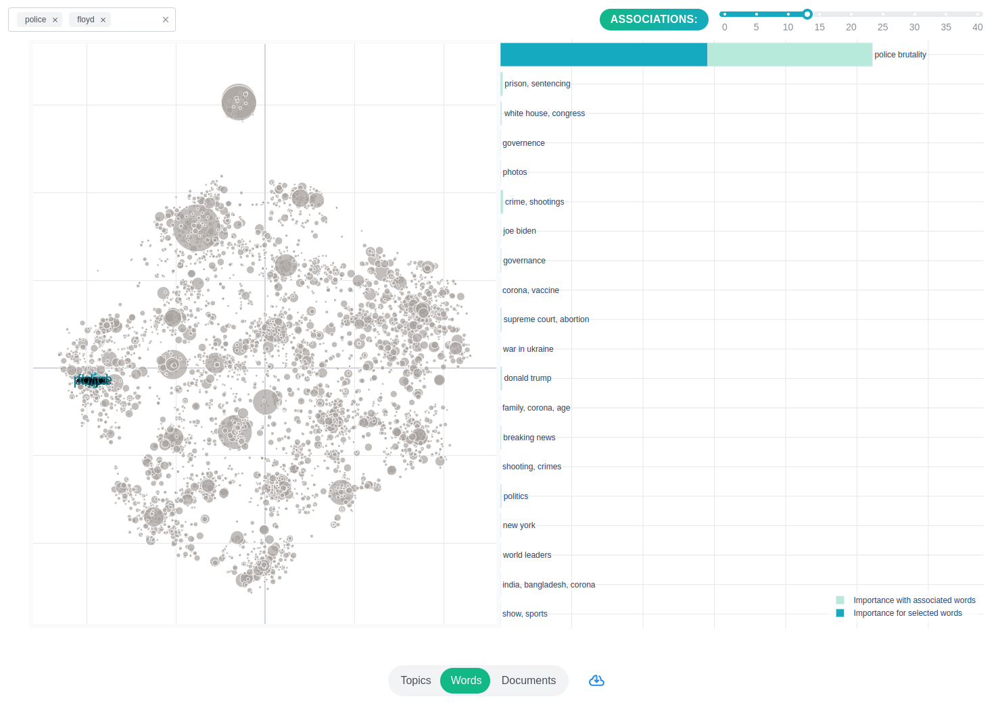
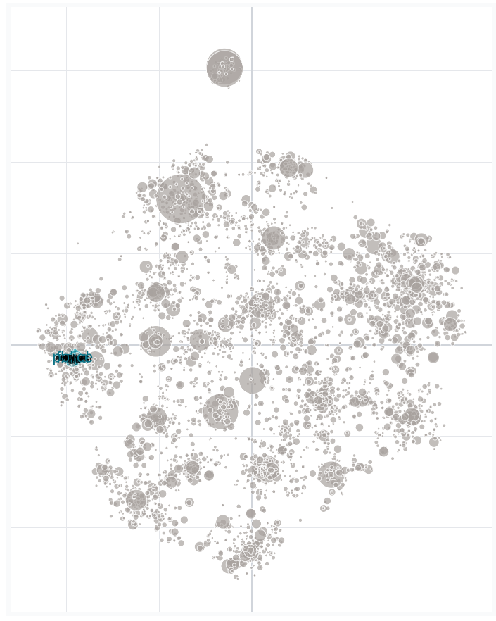
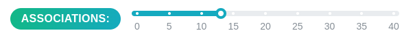
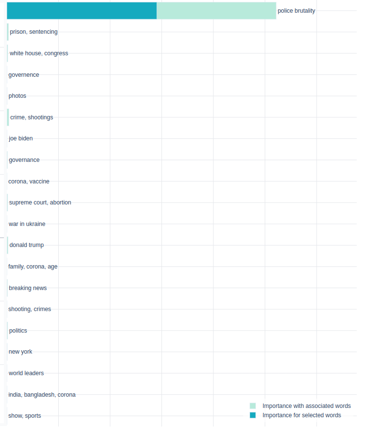

.. _usage words:

Investigating Words
=======================

When you click 'Words' on the navigation bar you will be presented with this screen.

Word map
^^^^^^^^^^^^^

On the left you will see a plot showing you all the words, aka. the word map.

Word distances are calculated from correlations between words in topics.
Positions are calculated with t-SNE.
You can zoom this graph by dragging your cursor and enclosing a selection area.

Selecting Words
^^^^^^^^^^^^^^^^^^^^

You can select words by typing them into the field on the top left and searching for them.
Multiple words may be selected at the same time.
Clicking a word on the map adds the word to the selection.

Associations
^^^^^^^^^^^^^
Closely associated words also get highlighted on the graph and are included in calculations.
The most closely associated words are the ones that have the lowest distance to the given words.
Topicwizard finds the specified amount of closest words to the selected ones.
The number of associated words can be adjusted with this slider:

Important Topics
^^^^^^^^^^^^^^^^^^^^^^
You can see which topics use the selected word and their associations most frequently by glancing at the bar plot
to the right.

:ref:`Topics <usage topics>`
:ref:`Documents <usage documents>`